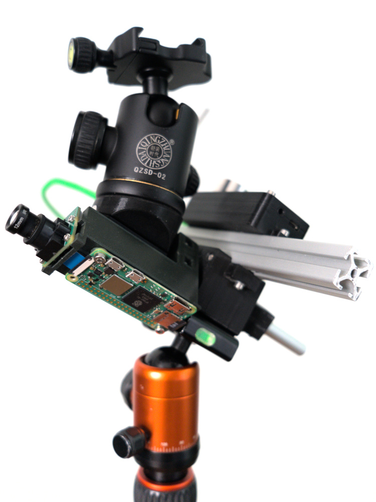
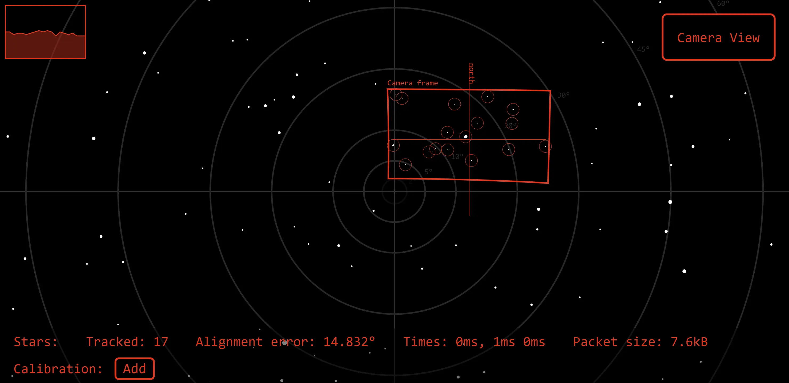

# Open-source Travel Photography Star Tracker

In-progress project that aims to build an easy-to-use, short duration, light-weight start tracker for wide-angle astro photography.

Features:
- Roughly 15 minutes tracking time
- No manual alignment required
- Battery/USB powered
- Designed as in-place tripod adapter
  - 3/8" female on bottom side for direct mounting on a tripod
  - 3/8" male screw on top side for ball head attachment

## Alignment tool

Currently there is no working prototoype of the product.
However, a working automatic alignment tool has been engineered to facilitate the alignment of simple static rotation axis star trackers.

The alignment tool consists of a low-noise IMX462 camera module together with a Raspberry Pi Zero 2 W and is able to estimate the alignment error of the rotation axis to the Earth's pole.
Following picture shows the hardware mounted on a custom star tracker, where the camera is aligned with the rotational axis:

The software captures images for continuous attitude estimation.
After pre-processing the raw image, the star positions and the resulting attitude is calculated using an algorithm ([see Github](https://github.com/ntobler/ruststartracker)) proposed by [Pedrotty et al., 2020](https://ntrs.nasa.gov/citations/20200001376).
The tool requires only coarse initial camera calibration data, as high-confidence measurements can be used to refine the calibration parameters.
Furthermore, mechanical misalignment of the camera and the star tracker can be compensated for by using a simple calibration procedure.
A web application accessible through the Raspberry Pi's WiFi functionality can be used to visualize the error when aligning the tracker manually.

Please refer to the [installation manual](docs/raspberrypi.md).
Unfortunately, the operation manual is work-in-progress.
